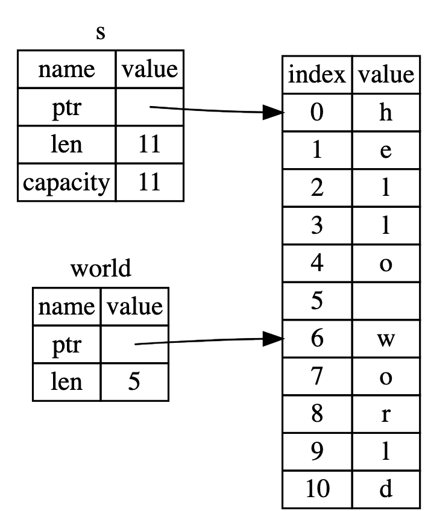

## 1. Create Project
* Create `Helloword` Project and run with Cargo:  
    * Create Project:`cargo new  Helloword `
    * Run Project: `cd Helloword` then `cargo run`

* `let` can only be used in function  
* Install `crate` (the dependencies lib like `npm`) : `cargo install <lib name>`
* Uninstall `crate` (the dependencies lib like `npm`) : `cargo uninstall <lib name>`
* All needed dependencies info are added in `Cargo.toml` like `package.json` in Nodejs
* The version of needed dependencies info are locked in `Cargo.lock` like `package-lock.json` in Nodejs

## 2. String type `str`,`&str` and `String` and `&String`
* [web.mit.edu/rust-lang_v1.25](http://web.mit.edu/rust-lang_v1.25/arch/amd64_ubuntu1404/share/doc/rust/html/book/first-edition/strings.html)
* [https://doc.rust-lang.org/book/ch04-03-slices.html](https://doc.rust-lang.org/book/ch04-03-slices.html)


* **Figure 1:**
    * `s` is the `String`. It has  these attribute : {`ptr`, `len`, `capacity`}. 
    * `world` is the `slice string` ,`&str`. It only has these attribute : {`ptr`, `len`}
    * `&String` can `automatically coerce` to a `&str`. This is a feature called [Deref coercions](http://web.mit.edu/rust-lang_v1.25/arch/amd64_ubuntu1404/share/doc/rust/html/book/first-edition/deref-coercions.html).
    * Note that you normally **cannot access** a `str` directly
     


```rust
    let ref_literal_str:&str ="hello world";
    let s1:String = ref_literal_str.to_string();

    let s:String = String::from(ref_literal_str); 
    let world:&str = &s[6..10];
    let ref_literal_str:&str = s.as_str();
```


* A `string slice` is a reference to part of a String, and it looks like this: `let world:&str = &s[6..10];`

    * A `&str` is `string slice`. A string slice has a fixed size, and cannot be mutated. It is a reference to a sequence of UTF-8 bytes.

    * The `"hello world"` is a `string literal` and its type is `&'static str`. A string literal is a string slice that is statically allocated, meaning that it’s saved inside our compiled program, and exists for the entire duration it run.

    * `str` is actually the literal string in heap. Note that you normally **cannot access** a `str` directly, but only through a `&str` reference. This is because str is an [unsized type](http://web.mit.edu/rust-lang_v1.25/arch/amd64_ubuntu1404/share/doc/rust/html/book/first-edition/unsized-types.html) which requires additional runtime information to be usable

* A `String` is a `heap-allocated` string. This string is growable, and is also guaranteed to be UTF-8. Strings are commonly created by converting from a `string slice` using the `to_string` method. It has  these attribute : {`ptr`, `len`, `capacity`}  see **s** in **figure 1** .
    * `String` is the abstract of `Vect` type. So `String` variable is just the `Vector` array of `char`. This vector holds a reference to `str` and string size and string capacity  . `Rust` always pre-know size of `String` when compiling time
    * Can convert String to the other type by calling these built-in method
        * To slice string `&str`  : `.as_str()`
        * To array of u8  `&[u8]` : `.as_bytes()`
* **Concatenation** 
    * If you have a `String`, you can concatenate a `&str` to the end of it:
    ```rust
        let hello:String = "Hello".to_string();
        let world:&str = "world";
        let hello_world:String = hello + world;
    ```
    * But if you have two `Strings`, you need an `&`
    ```rust
        let hello:String = "Hello ".to_string();
        let world:String = "world!".to_string();
        let hello_world:String = hello + &world;
    ```
    * This is because `&String` can automatically coerce to a `&str`. This is a feature called `Deref coercions`.
* **Unsize Type** : Rust understands a few of these types, but they have some restrictions. There are three:
    * We `can only manipulate` an instance of an `unsized type via a pointer`. An `&[T] works fine`, but a [`T] does not`.
    * `Variables and arguments cannot have dynamically sized types`.
    * Only the last field in a struct may have a dynamically sized type; the other fields must not. Enum variants must not have dynamically sized types as data.

## Object Type:
### Struct
* Declare `Struct Hello{ num1:i8,num2:i8,st:String};`
* We can use struct as the same as `Class` in C by `impl` more method for `Struct`
    * `impl Hello{ fn method1(){} .....}`
* `self` === `this` in CPP or `self` on Python

### Enum

* Declare `Enum EnumExp{ S(String) , I(i8)};`
* We can  also use `impl`to  implement method for `Enum`
* `self` === `this` in CPP or `self` in Python

### Interface:

* The interface can be implemented using `trait`

